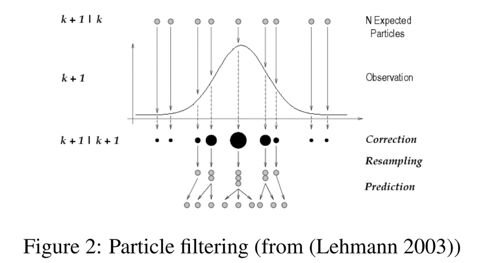

# Sequential Monte Carlo overview


Sequential Monte Carlo (SMC) is a family of algorithms for iteratively sampling from a posterior distribution generally in state-space style models:

$$ y_t \sim g_t(y_t | x_t, \theta)$$
$$ x_t \sim f_t(x_t | x_{t-1}, \theta) $$ 

Some goals in analyzing such models include:

 - filtering (online estimation): determining $p(x_T | y_{1:T}, \theta)$
 - smoothing: determining the (conditional) posterior $p(x_{1:T} | y_{1:T}, \theta)$
 - parameter estimation: determining $p(\theta | y_{1:T})$ 
 - likelihood calculation: determining $p(y_{1:T} | \theta)$

Parameter estimation is generally a hard problem in this context, with ongoing research.

# Some SMC methods

Some of the methods in the family of SMC and related algorithms include:

 - bootstrap filter
 - auxiliary particle filter
 - Liu and West filter and iterated filtering 2 (IF2)
 - particle MCMC
 - ensemble Kalman filter

This is just a partial list, focused on methods included in NIMBLE.

# Particle filtering: basic ideas

The basic idea is to approximate the filtering distribution using a sample. We start with an initial sample (not conditioned on the data) and then propagate the sample forward in time, reweighting each element of the sample based on how well it matches the model density at time t (i.e., the prior for $x_t$ and likelihood for $y_t$), and then sampling the new set of particles based on the weights. 

This treats $\theta$ as known, so it does not appear in the notation.

Here's pseudo-code for the bootstrap filter, where

   - $q$ is a proposal distribution that propagates the sample forward in time
   - $w_t$ and $\pi_t$ are (unnormalized) weights and (normalized) weights

Graphically, one can think of it this way:

<center></center>

# SMC algorithm implementation

Our SMC algorithms are implemented using nimbleFunctions (of course!).

Each time step has its own nimbleFunction, because we need fully model-generic calculations that can't assume any particular structure for a given time step (and at the moment NIMBLE can't easily store model dependencies for multiple nodes in a single data strucutre).

Here's a simplified version of the bootstrap filter available in NIMBLE.

The overall filtering nimbleFunction simply iterates through each individual time step function and builds up the overall likelihood from the time step-specific pieces.

```{r, basic-smc, eval=FALSE}
bootstrapFilter <- nimbleFunction(
  setup = function(model, latentNodes) {
    my_initializeModel <- initializeModel(model)
    latentNodes <- model$expandNodeNames(latentNodes, sort = TRUE)

    ## Set up storage for weighted and unweighted samples.
    dims <- lapply(latentNodes, function(n) nimDim(model[[n]]))
    mvWSpec <- modelValuesConf(vars = c('x', 'wts'),
                               types = c('double', 'double'),
                               sizes = list(x = dims[[1]], wts = 1))
    mvWSamples <- modelValues(mvWSpec)
    mvEWSpec <- modelValuesConf(vars = c('x'), types = c('double'),
                                sizes = list(x = dims[[1]]))
    mvEWSamples <- modelValues(mvEWSpec)

    ## Set up a nimbleFunction for each time point
    bootStepFunctions <- nimbleFunctionList(bootstrapStepVirtual)
    timePoints <- length(latentNodes)
    for (t in 1:timePoints)
      bootStepFunctions[[t]] <- bootstrapStep(model, mvWSamples,
                                              mvEWSamples, latentNodes, t)
  },
  run = function(M = integer()) {
    my_initializeModel$run()
    resize(mvWSamples, M)
    resize(mvEWSamples, M)
    ## Main algorithm steps
    for(t in 1:timePoints)
      bootStepFunctions[[t]]$run(M)
  }
)

```
# Lists of nimbleFunctions

The bootstrap filter created a list of nimbleFunctions, one for each time step. 

The key steps are:

   - define a 'virtual' nimbleFunction that is a *base class* (basically a skeleton function)
   - define a *nimbleFunctionList* based on that virtual nimbleFunction
   - create each individual nimbleFunction by calling a nimbleFunction generator that inherits from the virtual nimbleFunction

Then one can call the run function or other run-time methods of the elements of the list of nimbleFunctions in the run code of the overall nimbleFunction.

Similarly, an MCMC is composed of a list of individual sampler functions (of which we've seen many examples) specialized to nodes of a model.

# One-step algorithm

Here's what is done at each step of the bootstrap filter.

```{r, one-step, eval = FALSE}
bootstrapStepVirtual <- nimbleFunctionVirtual(
  run = function(M = integer()) {}
)

bootstrapStep <- nimbleFunction(
  contains = bootstrapStepVirtual,
  setup = function(model, mvWSamples, mvEWSamples, latentNodes,
                   timePoint) {
    ## Determine model nodes from current and previous time steps.
    notFirst <- timePoint != 1
    prevNode <- latentNodes[if(notFirst) timePoint - 1 else timePoint]
    thisNode <- latentNodes[timePoint]
    prevDeterm <- model$getDependencies(prevNode, determOnly = TRUE)
    thisDeterm <- model$getDependencies(thisNode, determOnly = TRUE)
    thisData   <- model$getDependencies(thisNode, dataOnly = TRUE)
  },
  run = function(M = integer()) {
    ids <- integer(M, 0)
    wts <- numeric(M, 0)
    for(m in 1:M) {   # for each particle...
    
      ## Get values from previous time point.
      if(notFirst) {
        copy(from = mvEWSamples, to = model, nodes = 'x',
             nodesTo = prevNode, row = m)
        model$calculate(prevDeterm)
      }
      
      ## Simplest proposal is from the prior, which also simplifies
      ## calculation of the weights.
      model$simulate(thisNode)
      copy(from = model, to = mvWSamples, nodes = thisNode,
           nodesTo = 'x', row = m)
           
      ## Update any intermediate nodes.
      model$calculate(thisDeterm)
      
      ## Calculate likelihood, giving unnormalized weight.
      wts[m] <- exp(model$calculate(thisData))
      mvWSamples['wts', m][1] <<- wts[m]
    }
    
    ## Resample to get equally-weighted sample.
    rankSample(wts, M, ids)
    for(m in 1:M){
      copy(from = mvWSamples, to = mvEWSamples, nodes = 'x',
           nodesTo = 'x', row = ids[m], rowTo = m)
    }
  })
```
